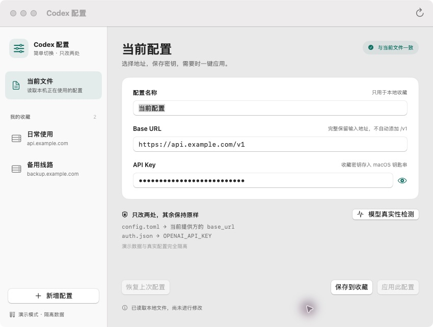
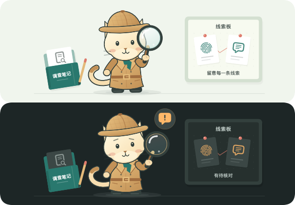
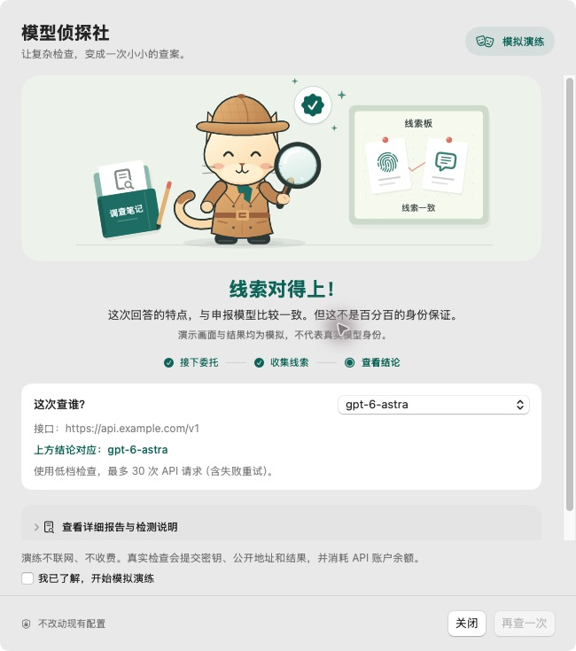

# Codex 配置

一个 Swift + SwiftUI 原生 macOS 小工具。单窗口与状态栏菜单，无 WebView、独立后台服务或数据库。线路配置在本地管理；可选启用 iCloud Drive 加密同步，模型检测仅在主动操作时连接检测网站。



## 本机验证

1.0 版本基线：2026-09-08，Apple Silicon / macOS 15.7.2，Release 构建，隔离演示模式（1.1 新增按需网络检测，以下体积为 1.0 测量值）：

- 应用包约 **1.2 MB**，DMG 约 **621 KB**。
- 首次测量从进程启动到 SwiftUI 首次出现约 **1.57 秒**；随后三次分别为 **207 / 244 / 221 毫秒**。这是首次视图出现标记，不是完整画面绘制完成或严格冷启动基准。
- 空闲物理内存占用（`vmmap` physical footprint）约 **31–35 MB**；`ps` 的 RSS 约 **95–100 MiB**。不同内存口径不可混用。
- **24 项**核心自动化测试通过。GUI 手动自动化验证了新增、输入校验、保存收藏、应用确认、应用成功及恢复流程。
- 测试前后真实的两个 Codex 文件 SHA-256 一致。测试密钥是假数据，未测试远端连通性。

实际速度与内存会受系统版本、机器、首次启动及钥匙串交互影响，不承诺固定数值。

## 安装与使用

要求 macOS 13 或更新版本。构建默认生成当前机器架构的程序。

1. 打开 `dist/CodexConfig.dmg`，把应用拖入 `Applications`；也可以直接运行 `dist/CodexConfig.app`。
2. 第一次打开自动读取当前用户的 `~/.codex/config.toml` 和 `~/.codex/auth.json`，不写入这两个文件。
3. 填写配置名称、完整 Base URL、API Key，点击 **保存到收藏**。收藏不影响 Codex 当前配置。
4. 选择收藏并点击 **应用此配置**，确认后才更新 Codex 文件。
5. 重启 Codex 或相关会话，使它重新读取配置；本工具不控制或强制关闭 Codex。

`⌘N` 新增配置，`⌘S` 保存收藏。关闭窗口后保留状态栏菜单，可随时重新打开主窗口；从菜单选择「退出 Codex 配置」或按 `⌘Q` 退出。

状态栏菜单显示当前地址与收藏线路，地址和密钥均与当前文件一致的收藏显示 ✓（完全相同的多条收藏都会标记），选择线路并确认后直接应用收藏的地址和密钥，保留编辑区未保存的内容。切换沿用原有备份、恢复及外部文件冲突检测；当前文件不可用或存在待恢复事务时禁止切换。每次打开菜单会刷新本地配置与收藏，切换后仍需重启 Codex 或相关会话。

默认目标为当前用户的 `~/.codex`，不硬编码用户名。

## 1.2 · 小白友好的「模型侦探社」

主界面点击 **模型检测**，选模型、阅读费用与隐私说明，再点 **开始查案**。详细匹配数字收进「查看详细报告与检测说明」，默认只展示容易理解的结论。

| 情况 | 小侦探的表现 | 给出的结论 |
| --- | --- | --- |
| 接到任务 / 收集回复 | 带着笔记出发、移动放大镜找线索 | 正在检查，尚未下结论 |
| 收集到足够进度 | 扫描线索板、比对笔记 | 仍等待网站的最终结果 |
| 线索一致 | 点头、微笑、绿色印章与小星星 | 特点比较一致，但不是百分百身份保证 |
| 发现差异 | 歪头、提示感叹号 | 建议核对渠道与模型名称，不直接认定是假模型 |
| 证据不足 / 没有有效回复 | 托腮思考、问号 | 先不下结论，查不出不等于假模型 |
| 断线 / 检测失败 / 提交未知 | 对讲机或信封提示 | 解释下一步，不把网络故障当成真假结论 |
| 请求停止 / 已停止 | 合上笔记、拎起公文包 | 收到网站确认后才宣布收工 |

动画由原生 SwiftUI `Canvas + TimelineView` 绘制，不引入视频、WebView、远程图片或动画依赖。只在需要时以最多 30 FPS 刷新；结尾动画播放 2.6 秒后停止。使用单调时钟累计实际播放时间，后台暂停后回来接着播放，并遵循系统「减少动态效果」。真实检测进度只来自网站报告，不使用动画计时伪造百分比，也不为了播完动画延迟结果。

侦探形象细化了猎鹿帽格纹、风衣翻领与腰带、绿色围巾、猫尾和镜片反光。出发时交替迈步，寻找时手臂、放大镜和视线联动，比对时扫描线索板；结果使用短暂的点头、歪头或托腮动作，随后保持安静。



53 项离线校验通过，另有 1 项可选预览导出验证通过；网站会话测试默认跳过。动画校验覆盖前后台暂停恢复、结尾停止、放大镜握持、减少动态效果，以及 14 种场景在深浅色和 320 / 602 点画布下的原生渲染。原有测试继续覆盖状态映射、无有效样本不能判为成功、断网不能显示旧的成功结论、进度完成不等于结果完成，以及文案保留必要的不确定性。实机隔离演练已验证搜索中连续帧发生变化、结案后动画区域保持像素一致，以及模拟结果面板布局。

导出全部状态与连续搜索帧，便于以后调整造型时复查：

```bash
DETECTIVE_SNAPSHOT_DIR="$PWD/.build/detective-review" swift test --filter DetectiveAnimationTests
```

演示模式可以在详细报告中选择不同的「演练结局」。以下参数只作用于隔离演示，不改变系统外观或真实检测：

```bash
open -n dist/CodexConfig.app --args --demo --demo-outcome 发现差异
open -n dist/CodexConfig.app --args --demo --demo-dark --demo-reduce-motion --demo-outcome 证据不足
```

## 模型检测说明（1.1 起支持）



1. 选择当前文件或任意收藏，在编辑区点击 **模型检测**。使用当前编辑区的地址与密钥，不要求先应用或保存。
2. 下拉框仅有 **gpt-6-astra**、**gpt-5.6-sol** 两个检测对象；实际请求的 `model` 使用同名值。
3. 固定网站的 **低档 `tier=low`**，不是修改模型的 `reasoning_effort`。从网站读取实际样本数量；当前为 20 次计划请求、10 次重试预算、最多 30 次，3 并发。
4. 阅读数据和费用说明，勾选同意后点击 **开始查案**，确认才发送 Key。不会改动 Codex 的 `model`、`base_url`、认证文件或其他配置。
5. 面板显示进度、有效样本、匹配度和结果，支持停止任务和断网后继续查询同一报告。

**数据流必须了解：**此功能对接的是 `https://meowllm.top/` 的服务端检测，不是本地鉴真。API Key 会发送给该网站并经过其 Cloudflare 代理；网站声明不长期保存 Key，但我们无法独立保证其服务器存储行为。请求地址和检测结果会公开，调用费用由对应 API 账户承担。不发送收藏名称或分组，不自动检测，不自动改写配置。

匹配度不是身份概率；“强指向申报模型 / 强指向其他候选 / 证据不足”仅为该网站的指纹推断。低档样本较少，不是模型真实性保证。界面不把证据不足、中断或无有效样本标为鉴真通过。

### 会话、错误与停止

- 使用原生 `URLSession` 和临时 Cookie 会话，只有主动打开面板才建立网络连接；Cookie、CSRF 和报告不落盘，拒绝 HTTP 重定向，密钥只出现在 HTTPS POST 请求体中。
- 创建任务**不自动重试**。提交超时或返回不确定结果时可能已经计费，面板提示“提交结果未知”，不再次自动创建任务。
- 查询报告每 3 秒一次，连续失败 3 次会暂停，可继续查询而不重新提交；超过 16 分钟也只暂停本地跟踪，不假报服务器已停止。
- 停止请求发出后继续查询，收到网站的结束状态后才显示已停止或结束。退出应用不会自动停止远端任务，并会丢失临时会话的停止权限，因此检测中退出有明确提示。
- 只支持网站可访问的公网 HTTPS 默认 443 端口；本地模型地址、内网或自定义端口不适用。
- 这是基于网站现有前端发现的**非官方稳定接口**。网站升级、限流或服务故障可能影响检测；接口说明见 [docs/openapi/meowllm.yaml](openapi/meowllm.yaml)。

### 检测功能验证

36 项离线自动化测试覆盖既有文件修改、两个模型/低档预算、提交同意、精确请求字段、错误信息脱敏、模糊提交不重试、取消前不发 Key、报告状态及停止请求。另有显式启用的网站会话测试：只获取公开元数据并发送空对象以验证拒绝行为，**不发送密钥、不创建检测任务**。

```bash
swift test                         # 离线测试；网站测试默认跳过
MEOW_LIVE_SMOKE=1 swift test --filter DetectionTests/testOptInLiveSessionWithoutCredentials
```

开发验证没有使用真实 Key 完成付费检测，不把模拟报告当作真实鉴真结果。`--demo` 中检测服务完全模拟，面板明确显示“隔离演示”。

## iCloud 跨 Mac 同步

侧栏点击 **iCloud 同步**。首次在 iCloud Drive 中创建专用空文件夹，选择「首次创建」，设置至少 12 个字符的同步密码；其他 Mac 选择「连接已有」，选同一文件夹并输入相同密码。请等待第一台 Mac 的文件上传完成后再连接第二台。

- 启用后应用打开期间每 15 秒自动合并，也可立即同步。关闭应用后暂停，无额外后台进程。
- 自动同步收藏名称、地址、API Key，以及收藏删除。恢复网络后继续同步离线修改。
- 同一收藏并发编辑会保留「同步冲突」副本；删除与离线编辑冲突时保留编辑版本。核对后可手动删除不需要的副本。
- 首次合并保留两端收藏；独立创建、名称相同的收藏不会仅按名称去重。
- API Key 导入本机钥匙串，不自动应用线路，不同步 YOLO 或当前 Codex 文件。
- 「暂停并断开」保留本机收藏与云端文件，并删除本机保存的解锁密钥；再次连接需要同步密码。
- 界面区分本地合并与 iCloud 上传状态。「已同步」表示本机已合并且系统确认可见文件已上传，不保证另一台 Mac 已下载或导入。iCloud 错误、文件缺失或解密失败时暂停并重试。

同步内容使用 **AES-256-GCM** 认证加密；密码经 **PBKDF2-HMAC-SHA256 / 600,000 次迭代 / 随机 32 字节盐** 派生密钥。同步空间只存格式头和加密事件，名称、地址和 API Key 均不明文落入云端；本机钥匙串保存派生密钥，密码不保存。密码遗忘后无法从同步文件找回；仍有已解锁 Mac 时可保留本机收藏，再建立新的同步空间。

同步使用不可变事件与因果版本合并，删除以加密删除记录传播。为防止离线设备重新带回旧数据，暂不自动清理历史；删除收藏不等于从加密历史中擦除该密钥。不上传原始认证文件或事务恢复快照。当前不提供密码轮换或共享空间成员管理。

通过原生文件选择器连接 iCloud Drive，使用系统文件协调读写，不需要 CloudKit 容器。两台 Mac 需开启 iCloud Drive 并能访问同一文件夹。收藏存储格式升级为包含同步元数据的对象，升级后请勿用旧版本管理收藏。

64 项自动化测试通过，2 项可选测试跳过。已用两套隔离收藏和内存钥匙串验证同步、冲突、删除、失败重试、错误密码与篡改拒绝；原生界面已完成隔离目录下的首次创建、密码确认、启用与完成状态演练。未完成两台真实 Mac 的 iCloud 端到端验收。

## Codex YOLO 模式

主界面以单行工具栏提供 **YOLO 模式** 开关、状态、说明入口与模型检测按钮；详细说明点击 ⓘ 查看。独立的全局开关切换即保存，不属于收藏，也不会应用编辑区未保存的地址或密钥。

- 开启：根级 `approval_policy = "never"`、`sandbox_mode = "danger-full-access"`（免审批、完全访问）。
- 关闭：根级 `approval_policy = "on-request"`、`sandbox_mode = "workspace-write"`（按需审批、工作区写入）；不是还原此前的自定义权限组合。
- 字段不存在时在根级新增，存在时只替换值；保留其他内容、注释与换行。不修改 `auth.json`。
- 使用现有事务、冲突检测与最近一步备份；点击 **恢复上次配置** 可以精确还原切换前的文件。
- 重启 Codex 或新建会话后读取。开关显示全局文件值；命令行、项目配置、profile 或受托管策略可能覆盖它，不代表正在运行的会话权限。
- 沿用本工具现有配置支持范围；当前文件无法读取或有待恢复事务时不可切换。

字段定义参见 [Codex 配置参考](https://developers.openai.com/codex/config-reference/)。

## 严格的修改边界

- 线路应用的 `config.toml`：仅替换 `model_providers.<当前 model_provider>.base_url` 的**值字节范围**。
- `auth.json`：仅替换已有根级 `OPENAI_API_KEY` 的**值字节范围**。
- 不增删或切换 provider，不改模型、MCP、登录模式或其他字段。权限仅由独立 YOLO 开关修改上述两个根级字段。保留其他字节，包括注释、缩进、换行、字段顺序。
- 地址原样保存，不自动补 `/v1`、删尾斜杠或发送连通性测试。
- 使用固定版本 toml++ 3.4.0 完整解析 TOML，依靠解析器的源位置定位，**不使用全局正则替换，也不重写整个 TOML 文档**。
- JSON 先解析检查，再定位根级字段，拒绝重复字段和账号登录令牌。

### 第一版支持范围

支持已经存在的自定义提供方，要求 `requires_openai_auth = true`、文件认证模式，以及已有字符串 `OPENAI_API_KEY`。

以下情况只提示原因，不擅自“修复”其他配置：

- 缺少目标文件或目标字段、文件语法错误。
- `keyring` / `auto` 认证存储、命令认证、账号登录令牌或非 API Key 登录模式。
- 旧式 `profile` 选择器、强制账号登录、自定义 `CODEX_HOME` 指向其他位置。
- 内置提供方的 `openai_base_url`（不在本版本的 `base_url` 修改范围内）。
- 符号链接、硬链接、非普通文件或超过 8 MB 的配置文件。

工具只能检查本地文件和自身继承的环境，无法获知已启动 Codex 的命令行覆盖项（如 `--profile`、`-c`），也不能保证受托管策略覆盖的设置生效。应用完成表示文件已写入，不代表远端认证已验证。

## 数据存储与恢复

管理器自身数据在 `~/Library/Application Support/CodexConfig/`，不向 `.codex` 添加持久化的管理器文件：

| 数据 | 位置 |
| --- | --- |
| 收藏名称、地址、密钥引用及同步版本 | `profiles.json`，不含密钥 |
| iCloud 文件夹书签与解锁密钥引用 | `cloud-sync.json`，不含密钥 |
| 待提交同步操作 | `sync-state-*.json.pending`，加密保存 |
| 收藏密钥 | macOS 钥匙串，服务名 `local.cc-gl.CodexConfig.profiles`，仅本机使用 |
| 最近一次切换的前后文件快照 | `last-change.json` |
| 管理器写入互斥锁 | `write.lock` |

恢复快照含原始认证数据，因此数据目录权限为 `0700`，备份为 `0600`。它是**受文件权限保护的本地明文备份，不是加密备份**。只保留最近一次切换，恢复成功后删除。不要分享此目录或提交它到版本控制。

每个目标文件在原目录暂存后原子替换，保留原权限；失败尝试回滚。两份文件不能作为一个整体原子提交，所以使用持久化恢复记录，异常退出后显示恢复入口。只有文件内容与该次切换的前/后版本一致才允许恢复，不覆盖第三方新增修改。

写入前、写入中和写入后会比较文件快照；管理器实例之间使用文件锁。但 Codex/编辑器不会遵守此锁，**无法完全排除最后一次检查与原子替换之间的竞争窗口**。切换时避免同时编辑文件或运行登录刷新操作。

恢复只支持最近一步，文件已有其他改动时会拒绝覆盖，备份保留供手工核对。恢复失败不会假报成功。收藏删除仅删除管理器收藏及对应钥匙串项，不改 Codex 文件，也不清除最近切换备份。

## 开发

需要 Xcode / Swift 5.9 或更新版本。无远程 SwiftPM 依赖，TOML 解析器已内置。

```bash
swift test
./scripts/build-app.sh          # Release .app
./scripts/build-app.sh --dmg    # Release .app + DMG
open dist/CodexConfig.app
```

隔离演示（不会读取真实 `.codex` 或钥匙串）：

```bash
open -n dist/CodexConfig.app --args --demo
```

演示数据放在系统临时目录，密钥只保存在进程内存中。文件测试使用随机临时目录，检测测试使用假密钥；显式启用的网站会话测试仅发送空对象，不接触真实 Codex 配置或钥匙串。

### 签名

默认使用本地 ad-hoc 签名，适合本机使用，**没有 Developer ID 公证**。跨机器公开分发需要 Apple Developer ID 签名和公证；不能宣称下载后一定无系统提示。重建 ad-hoc 应用后钥匙串可能重新请求访问。

```bash
SIGN_IDENTITY='Developer ID Application: ...' ./scripts/build-app.sh --dmg
# 公开分发前另行执行 notarytool 公证，并用 stapler 装订结果。
```

### 项目结构

```text
Sources/CTOMLPatch/          固定版本 toml++ + 极薄 C ABI 源位置接口
Sources/CodexConfigCore/     精确补丁、文件事务、恢复、钥匙串与收藏
Sources/CodexConfigApp/      SwiftUI 单窗口界面
Tests/CodexConfigCoreTests/  字节保持、异常回滚、外部冲突、收藏测试
Tests/CodexConfigAppTests/   动画计时、姿势和原生渲染验证
Resources/                  应用图标和 Info.plist
scripts/                    打包及图标生成
```

toml++ 采用 MIT 许可证，见 `Sources/CTOMLPatch/LICENSE`。应用包同时包含该许可证。
